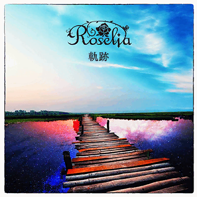
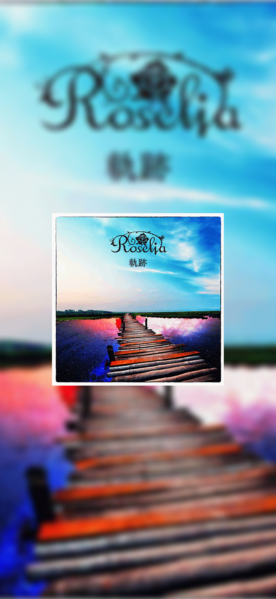

# wallpaper

Given a square image, this script creates a wallpaper with
- an upscaled, blurred version of the image in the background, and
- an upscaled version of the image in the foreground.

Currently it assumes that height > width.

## Example

**Input:**

**Output:**

Ran with `./run kiseki.png 2778 1284`.

